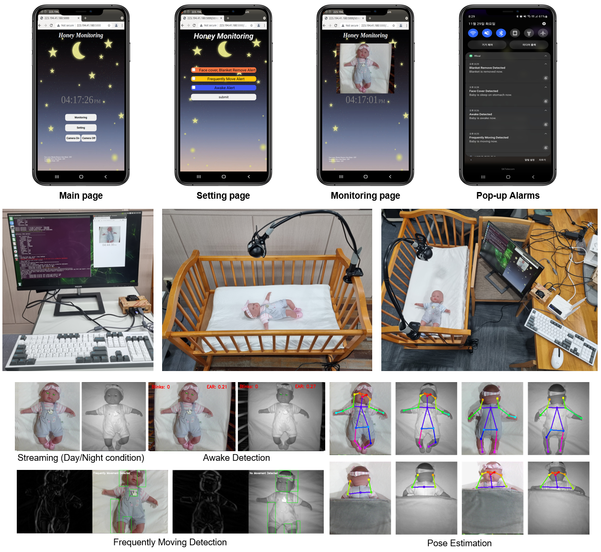
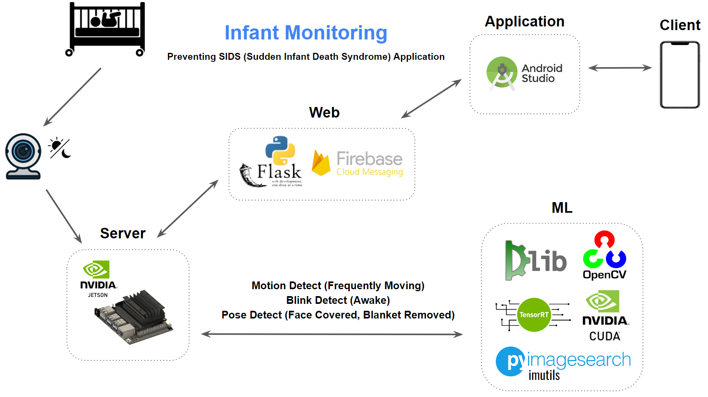
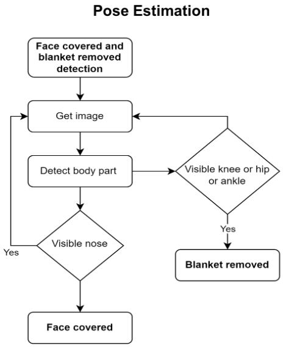
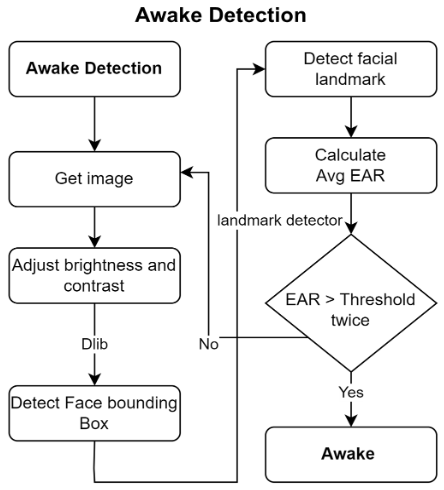
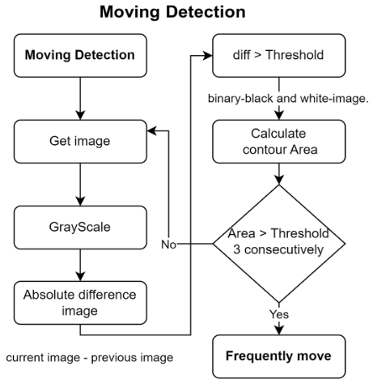

# __InfantMornitoring__
2022년도 2학기 참빛설계학기

## __Title__
- 영아 모니터링 및 SIDS 방지를 위한 모바일 어플리케이션 개발

## __Summary__
- 영아를 실시간 모니터링하여 SIDS를 예방하고, 모니터링을 안 할 때는 인공지능을 사용하여 영아의 상태에 대한 알림을 전달받을 수 있는 시스템  

## __Function__
- Flask의 HTTP 서버와 안드로이드 앱을 통한 실시간 모니터링                                    
- 감지할 영아의 상태/상황을 개별적으로 설정 (On/Off)
    - 아기가 엎드려서 얼굴이 가려지거나 담요가 얼굴을 덮은 상황 (Pose Detection)
    - 아기 몸에서 담요가 걷어진 상황 (Pose Detection)
    - 잠에서 깨어 눈을 뜨고 있는 상황 (Blink Detection)
    - 아기가 자주 움직이는 상황 (Motion Detection)
- FCM(Firebase Cloud Messaging)을 사용하여 앱으로 알림 전송

## __Poster__
<p align="center"></p>

## __Demo__
- Application, System Configuration, Performance Validation   
<p align="center"></p>   

- Demonstration Video   
<p align="center">
  <a href="https://youtu.be/pLjJEXWbmC0">
    
  </a>
</p>

## __Architecture__
<p align="center"></p>

## __Jetson Setup__
해당 프로젝트에서는 [Jetson Nano(Yahboom)](http://www.yahboom.net/study/jetson-nano)을 사용하였다.  
Jetson Nano(Yahboom) Micro SD 슬롯이 없고 16GB eMMC로 구동하기 때문에 저장공간 문제를 해결하기 위해 USB를 통한 booting 추천한다.  
Yahboom에서 제공하는 [Udisk System file](https://drive.google.com/drive/folders/1bNPN5zVxBnZNFa2-vDwwci_jUaDIo7G9)에는 jetpack 4.4.1이 기본적으로 설치되어 있고, 다른 라이브러리는 해당 링크에서 "NanoB01-64g20221104--ReadMe.txt"를 참고하길 바란다.


- [Jetson Nano(Yahboom)](http://www.yahboom.net/study/jetson-nano)에서 Development setup의 1.2~1.5까지의 과정을 수행한다.  
- python3와 pip3를 설치한다.
```sh
$ sudo apt-get install python3
$ apt-get install python3-pip
```
- jetson-stats(선택사항)  
CPU, GPU, RAM, Swap, Fan 등의 H/W 정보와 CUDA, OpenCV, TensorRT, JetPack 버전 확인 및 Fan Speed, Swap 공간 설정이 가능하다.
```sh
$ sudo apt-get update
$ sudo apt-get upgrade
$ sudo apt-get install python-pip
$ sudo -H pip install -U jetson-stats
$ sudo reboot

# Jetson-stats 실행
$ jtop
```
- Wi-Fi Driver install(Wi-Fi Adapter를 사용할 경우에만)  
해당 프로젝트에서는 포트포워딩을 위해 WRL-15449 Edimax 2-in-1 WiFi and Bluetooth 4.0 Adapter를 사용하였다.  
[EW-7611ULB(Edimax)](https://www.edimax.com/edimax/download/download/data/edimax/global/download/bluetooth/ew-7611ulb)에서 "EW-7611ULB Linux Wi-Fi Driver"를 설치 (Bluetooth 겸용이지만 Linux에서는 Wi-Fi만 작동)
```sh
$ sudo apt-get install git build-essential
$ git clone https://github.com/lwfinger/rtl8723bu
$ cd rtl8723bu
$ make ARCH=arm64
$ sudo make install
$ sudo modprobe -v 8723bu
$ iwconfig
```
### __issue__
- Jetson series에서 python 파일을 실행 시 "illegal instruction"이란 오류가 발생하는데 이는 "```export OPENBLAS_CORETYPE=ARMV8 python```"으로 해결할 수 있다. [참고사항](https://github.com/numpy/numpy/issues/18131)
- Jetson nano의 경우 jetpack을 설치하게 되므로 꼭 python version과 dlib의 version을 확인하여 dlib의 version을 맞춘다. 
- 해당 프로젝트에서는 python 3.6과 dlib 19.8.1을 사용했으므로 ```pip install dlib-19.8.1-cp36-cp36m-win_amd64.whl```으로 설치할 수 있다. [참고사항](https://stackoverflow.com/questions/69763889/import-dlib-on-jetson-nx-got-illegal-instruction-core-dumped)
- Jetpack을 SDK Manager를 통해 설치했는데 이때 원하는 version의 Jetpack이 목록에 없을 경우 SDK Manager를 ```sdkmanager --archivedversions```로 시작하면 된다. [참고사항](https://forums.developer.nvidia.com/t/jetpack-4-2-sdk-manager/187187)
- Pytorch와 torchvision은 꼭 Jetpack version과 호환되는 version을 확인하여 설치해야한다. [참고사항](https://yoonchang.tistory.com/25)


## __Pose Detection__
- Pose Estimation Model은 Pose-DenseNet121-Body을 사용  
- [dusty-nv/jeston-inference](https://github.com/dusty-nv/jetson-inference)의 poseNet을 수정해 완성했다.  
```python
# posenet.py

import sys

from jetson_inference import poseNet
from jetson_utils import videoSource, videoOutput, logUsage, cudaFromNumpy, cudaAllocMapped, cudaConvertColor, cudaDeviceSynchronize
from fcm import sendMessage

# Use Pose-DenseNet121-Body as a pre-trained pose estimation model, Set minimum detection threshold to use to 0.1
net = poseNet("densenet121-body", sys.argv, 0.1)   
output = videoOutput("", argv=sys.argv)
# Using global variables as thresholds to judge the situation
stomachCount = 0
blanketCount = 0

# parameter is the frame of the video taken from the camera through cv2.VideoCapture()
def poseDetect(frame):
    global stomachCount
    global blanketCount
    
    # In OpenCV, colors are represented in BGR order, but In the case of cuda-based posenet, since it is in RGB order, it goes through the process of converting from BGR to RGB for correct rendering.

    img = frame
    # convert to CUDA (cv2 images are numpy arrays, in BGR format)
    bgr_img = cudaFromNumpy(img, isBGR=True)
    # convert from BGR -> RGB
    rgb_img = cudaAllocMapped(width=bgr_img.width,height=bgr_img.height, format='rgb8')

    cudaConvertColor(bgr_img, rgb_img)

    # The return value of poseNet.Process(), poses, represents one object (such as a person) and contains a list of keypoints and links that have been detected.
    # Since only one baby is being monitored in this project, poses returns a list of keypoints of detected babies.
    poses = net.Process(rgb_img, "links,keypoints")

    for pose in poses:
        # Store the keypoints of detected babies in a set
        keyset = set()
        for keypoint in pose.Keypoints:
            keyset.add(keypoint.ID)

# "keypoints": ["nose", "left_eye", "right_eye", "left_ear", "right_ear", "left_shoulder", "right_shoulder","left_elbow", "right_elbow", "left_wrist", "right_wrist", "left_hip", "right_hip", "left_knee", "right_knee", "left_ankle","right_ankle", "neck"]

        # nose not detected
        if 0 not in keyset:
            # If a nose is not detected the first time, a notification is sent and resent every 150 frames
            if stomachCount is 0 :
                stomachCount += 1
                print("\n==========baby sleep on stomach!==========\n")
                sendMessage('Face Cover Detected', 'Baby is sleep on stomach now.')
            else :
                if stomachCount >= 150 :
                    stomachCount = 0
                else :
                    stomachCount += 1
        # Left hip, right hip, left knee, right knee, left ankle, right ankle not detected
        if 11 in keyset or 12 in keyset or 13 in keyset or\
            14 in  keyset or 15 in keyset or 16 in keyset:

            # If a nose is not detected the first time, a notification is sent and resent every 450 frames
            if blanketCount is 0 :
                blanketCount += 1
                print("\n==========blanket is removed!==========\n")
                sendMessage('Blanket Remove Detected', 'Blanket is removed now.')
            else :
                if blanketCount >= 450 :
                    blanketCount = 0
                else :
                    blanketCount += 1

    # render the image
    output.Render(rgb_img)
```
### __flow chart__
<p align="center"></p>

### __description__
- 대상의 몸에서 관절이나 주요 key point를 찾아내서 대상이 뒤집혔는지, 대상이 덮고 있는 이불이나 담요가 제거되었는지 판단한다.
- 실시간으로 이미지를 가져와 대상의 Body part를 추출하고, 추출된 Body part 중 코가 포함되어 있지 않으면 대상이 뒤집혔다고 판단한다.
- 엉덩이, 발목, 그리고 무릎 중 하나의 부위라도 존재하면 대상에게서 담요가 제거되었다고 판단한다.

### __issue__
- 마지막 줄의 output.Render()에서 image를 렌더링하는 창은 표시되나 image가 검은색으로 나타나는 문제가 있었다.   
- 알아본 결과 이는 PoseNet으로 전달하는 매개변수인 frame의 문제였다.  
- 매개변수인 frame은 OpenCV에서 추출한 video frame으로써 색을 BGR로 표현한다.  
- 하지만 CUDA 기반인 PoseNet의 경우에는 RGB로 image를 표현하기 때문에 이를 해결하기 위해 Converting from BGR to RGB을 해준다.  
- 이는 [jetson-utils/cuda-from-cv.py](https://github.com/dusty-nv/jetson-utils/blob/master/python/examples/cuda-from-cv.py)를 참고하였다.  
- 시도는 안 해봤지만 cv2.split()를 사용해 image를 분리한 후, cv2.merge()를 이용해 image의 b,r을 변경할 수 있을 것 같다. ( [Converting_split_merge](https://zzsza.github.io/data/2018/01/23/opencv-1/) )

## __Blink Detection__
- [pathak-ashutosh/Eye-blink-detection](https://github.com/pathak-ashutosh/Eye-blink-detection)의 detect_blinks를 수정해 완성하였다.
```python
# BlinkDetect.py
from scipy.spatial import distance as dist
from imutils import face_utils
from fcm import sendMessage

import imutils
import cv2
import time
import dlib

# define two constants, one for the eye aspect ratio to indicate
# blink and then a second constant for the number of consecutive
# frames the eye must be below the threshold
EYE_AR_THRESH = 0.3
EYE_AR_CONSEC_FRAMES = 3

# initialize the frame counters and the total number of blinks
COUNTER = 0
TOTAL = 0

# initialize dlib's face detector (HOG-based) and then create
# the facial landmark predictor
detector = dlib.get_frontal_face_detector()
predictor = dlib.shape_predictor('shape_predictor_68_face_landmarks.dat')

def eyeAspectRatio(eye):
	# compute the euclidean distances between the two sets of
	# vertical eye landmarks (x, y)-coordinates
	A = dist.euclidean(eye[1], eye[5])
	B = dist.euclidean(eye[2], eye[4])

	# compute the euclidean distance between the horizontal
	# eye landmark (x, y)-coordinates
	C = dist.euclidean(eye[0], eye[3])

	# compute the eye aspect ratio
	ear = (A + B) / (2.0 * C)

	# return the eye aspect ratio
	return ear

def blinkDetect(frame) :
	global TOTAL
	global COUNTER

	# grab the indexes of the facial landmarks for the left and
	# right eye, respectively
	(lStart, lEnd) = face_utils.FACIAL_LANDMARKS_IDXS["left_eye"]
	(rStart, rEnd) = face_utils.FACIAL_LANDMARKS_IDXS["right_eye"]

	# detect faces in the grayscale frame
	frame = imutils.resize(frame, width=420)
	gray = cv2.cvtColor(frame, cv2.COLOR_BGR2GRAY)
	rects = detector(gray, 0)

	# loop over the face detections
	for rect in rects:
		# determine the facial landmarks for the face region, then
		# convert the facial landmark (x, y)-coordinates to a NumPy
		# array
		shape = predictor(gray, rect)
		shape = face_utils.shape_to_np(shape)

		# extract the left and right eye coordinates, then use the
		# coordinates to compute the eye aspect ratio for both eyes
		leftEye = shape[lStart:lEnd]
		rightEye = shape[rStart:rEnd]
		leftEAR = eyeAspectRatio(leftEye)
		rightEAR = eyeAspectRatio(rightEye)

		# average the eye aspect ratio together for both eyes
		ear = (leftEAR + rightEAR) / 2.0

		# compute the convex hull for the left and right eye, then
		# visualize each of the eyes
		leftEyeHull = cv2.convexHull(leftEye)
		rightEyeHull = cv2.convexHull(rightEye)
		cv2.drawContours(frame, [leftEyeHull], -1, (0, 255, 0), 1)
		cv2.drawContours(frame, [rightEyeHull], -1, (0, 255, 0), 1)

		# check to see if the eye aspect ratio is below the blink
		# threshold, and if so, increment the blink frame counter
		if ear > EYE_AR_THRESH:
			COUNTER += 1

		# otherwise, the eye aspect ratio is not below the blink
		# threshold
		else:
			# if the eyes were closed for a sufficient number of
			# then increment the total number of blinks
			if COUNTER >= EYE_AR_CONSEC_FRAMES:
				TOTAL += 1

			# reset the eye frame counter
			COUNTER = 0
		
		if TOTAL >= 10 :
			print('Awake Detect')
			TOTAL = 0
			sendMessage('Awake Detected', 'Baby is awake now.')

		# draw the total number of blinks on the frame along with
		# the computed eye aspect ratio for the frame
		cv2.putText(frame, "Blinks: {}".format(TOTAL), (10, 30),
			cv2.FONT_HERSHEY_SIMPLEX, 0.7, (0, 0, 255), 2)
		cv2.putText(frame, "EAR: {:.2f}".format(ear), (300, 30),
			cv2.FONT_HERSHEY_SIMPLEX, 0.7, (0, 0, 255), 2)

	cv2.imshow("Blink Detect", frame)
	key = cv2.waitKey(1) & 0xFF
```
### __flow chart__
<p align="center"></p>

### __description__
- 눈을 떴는지 감았는지 판단하여 대상이 잠에서 깬 것을 확인한다. 
- 실시간 영상에서 이미지를 가져와서 밝기 및 대비를 조정한다. (밝기를 줄이고 대비를 증가시키면 낮과 밤 두 개의 조건에서 얼굴을 찾는 모델의 성능을 높일수 있기 때문) 
- Dlib과 opencv 라이브러리를 사용해 조정된 이미지에서 대상의 얼굴을 찾아내고, 찾아낸 얼굴에서 68개의 특징점을 추출한다. 
- 그중 눈의 특징점들을 가지고 eye aspect ratio를 계산한다. 
- EAR이 설정한 임계 값보다 클 때 눈이 떠졌다고 판단한다. 
- 설정한 Loop cycle 동안 눈이 떠졌다고 판단되면 대상이 잠에서 깼다고 최종 판단하게 된다.
- 한 block의 크기를 10초로 가지는 queue에 일시적인 움직임이 있었는지를 나타내는 flag 값들을 하나씩 저장하는데 3개의 연속적인 움직임이 있었다면 최종적으로 대상이 자주 움직인다고 판단한다.

## __Motion Detection__
[dmethylDragon/opencv-motion-detector](https://github.com/methylDragon/opencv-motion-detector)의 Motion Detector를 수정해 완성하였다.
```python
# Motion Detection.py

import imutils
import cv2
import numpy as np
import time

from collections import deque
from fcm import sendMessage

def motionDetect(frameQueue) :
    # Number of frames to pass before changing the frame to compare the current
    # frame against
    FRAMES_TO_PERSIST = 10

    # Minimum boxed area for a detected motion to count as actual motion
    # Use to filter out noise or small objects
    MIN_SIZE_FOR_MOVEMENT = 2000

    # Init frame variables
    first_frame = None
    next_frame = None

    # Init display font and timeout counters
    font = cv2.FONT_HERSHEY_SIMPLEX
    delay_counter = 0
    dq = deque()
    next_block_flag = False
    start_time = time.time()
    messageCheck = False
    # LOOP!
    while True:
        # Set transient motion detected as false
        transient_movement_flag = False
        block_movement_flag = False

        if next_block_flag:
            start_time = time.time()
            next_block_flag = False
        
        # Read frame
        frame = frameQueue.get()
        text = "Unoccupied"
        # Resize and save a greyscale version of the image
        frame = imutils.resize(frame, width=320)
        gray = cv2.cvtColor(frame, cv2.COLOR_BGR2GRAY)

        # Blur it to remove camera noise (reducing false positives)
        gray = cv2.GaussianBlur(gray, (21, 21), 0)

        # If the first frame is nothing, initialise it
        if first_frame is None: first_frame = gray

        delay_counter += 1

        # Otherwise, set the first frame to compare as the previous frame
        # But only if the counter reaches the appriopriate value
        # The delay is to allow relatively slow motions to be counted as large
        # motions if they're spread out far enough
        if delay_counter > FRAMES_TO_PERSIST:
            delay_counter = 0
            first_frame = next_frame

        # Set the next frame to compare (the current frame)
        next_frame = gray

        # Compare the two frames, find the difference
        frame_delta = cv2.absdiff(first_frame, next_frame)
        thresh = cv2.threshold(frame_delta, 25, 255, cv2.THRESH_BINARY)[1]

        # Fill in holes via dilate(), and find contours of the thesholds
        thresh = cv2.dilate(thresh, None, iterations=2)
        cnts, _ = cv2.findContours(thresh.copy(), cv2.RETR_EXTERNAL, cv2.CHAIN_APPROX_SIMPLE)

        # loop over the contours
        for c in cnts:

            # Save the coordinates of all found contours
            (x, y, w, h) = cv2.boundingRect(c)

            # If the contour is too small, ignore it, otherwise, there's transient
            # movement
            if cv2.contourArea(c) > MIN_SIZE_FOR_MOVEMENT:
                transient_movement_flag = True

                # Draw a rectangle around big enough movements
                cv2.rectangle(frame, (x, y), (x + w, y + h), (0, 255, 0), 2)

        # The moment something moves momentarily, reset the persistent
        # movement timer.
        if time.time() - start_time > 2:
            if transient_movement_flag == True:
                block_movement_flag = True
            if  len(dq) == 3:
                dq.popleft()

            dq.append(block_movement_flag)
            print('FIFO', dq)
            next_block_flag = True

        if sum(dq) == 3:
            text = "Frequently Movement Detected"
            if not messageCheck :
                messageCheck = True
                sendMessage('Frequently Moving Detected', 'Baby is moving now.')
        else:
            messageCheck = False
            text = "No Movement Detected"
        cv2.putText(frame, str(text), (10, 35), font, 0.75, (255, 255, 255), 2, cv2.LINE_AA)

        # Convert the frame_delta to color for splicing
        frame_delta = cv2.cvtColor(frame_delta, cv2.COLOR_GRAY2BGR)

        # Splice the two video frames together to make one long horizontal one
        cv2.imshow("frame", np.hstack((frame_delta, frame)))

        # Interrupt trigger by pressing q to quit the open CV program
        ch = cv2.waitKey(1)
        if ch & 0xFF == ord('q'):
            break
```

### __flow chart__
<p align="center"></p>

### __description__
- 대상이 자주 움직였는지 판단한다. 설정값에 따라 자주 움직였는지 판단함으로써 대상이 잠에서 깼는지 판단하는 task로도 사용할 수 있다. 
- 실시간 영상에서 이미지를 가져와서 Grayscale(회색화)로 변환한다. (움직임을 찾는것은 색상정보가 필요없어서) 
- 1초 전의 이미지와 현재의 이미지의 absolute difference(차이의 절댓값)을 구한다. 이 차이가 설정 임곗값 보다 크면 흰색, 작으면 검은색 영역으로 변환한다. 
- 흰색 영역을 확장시키고 윤곽선(contour)을 그린 후 윤곽선의 영역을 계산하고 계산 값이 설정 임곗값 보다 크면 일시적인 움직임이 있다고 판단한다. 